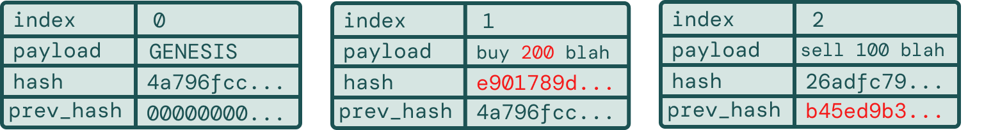
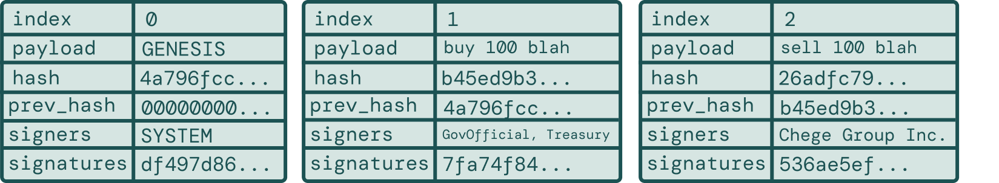

<p align="center">
    </a>
</p>
<p align="center">
  <a href="https://github.com/elviscgn/UkweliDB/actions/workflows/rust.yml">
    </a>
  &nbsp;
  <a href="https://github.com/elviscgn/UkweliDB">
    </a>
  &nbsp;
  <a href="https://github.com/elviscgn/UkweliDB/blob/main/LICENSE">
    
  </a>
</p>

UkweliDB ("truth" in Swahili) is a a tamper proof, verifiable, immutable database, written from scratch in Rust.


<h1>Quick Start</h1>
<h3>Installation</h3>
<h6>Clone the repository</h6>
1. <code>git clone https://github.com/elviscgn/ukweliDB</code> </br>
2. <code>cd ukweli</code>

<h6>Build the CLI</h6>
1. <code>cd ukweli_cli</code> </br>
2. <code>cargo build --release</code>

<h1>Basic Usage</h1>

<h3>1. Initialise Database</h3>
<code>ukweli init</code>

<p>This creates:</p>
<ul>
<li><code>~/.ukweli/default.ukweli</code> - Your database file</li>
<li><code>~/.ukweli/config.json</code> - Configuration</li>
<li><code>~/.ukweli/users/</code> - User keypairs</li>
<li><code>~/.ukweli/workflows/</code> - Workflow definitions</li>
</ul>
<h3>2. Create Users</h3>
<p>Users have cryptographic keypairs for signing records.</p>
<table>
<tr>
  <td><strong>Create a user</strong></td>
  <td><code>ukweli user create thabo</code></td>
</tr>
<tr>
  <td><strong>Give them a role</strong></td>
  <td><code>ukweli user add-role thabo land_officer</code></td>
</tr>
<tr>
  <td><strong>List all users</strong></td>
  <td><code>ukweli user list</code></td>
</tr>
<tr>
  <td><strong>View user details</strong></td>
  <td><code>ukweli user show thabo</code></td>
</tr>
</table>

<h3>3. Add Records</h3>
<table>
<tr>
  <td><strong>Simple record</strong></td>
  <td><code>ukweli record append "Thabo registered property #12345" --signers thabo</code></td>
</tr>
<tr>
  <td><strong>View all records</strong></td>
  <td><code>ukweli record list</code></td>
</tr>
<tr>
  <td><strong>View specific record</strong></td>
  <td><code>ukweli record show 1</code></td>
</tr>
<tr>
  <td><strong>Verify chain integrity</strong></td>
  <td><code>ukweli record verify</code></td>
</tr>
</table>

<h1>How it all works </h1>
<h2>1. Core Idea </h2>
<details> 
  <summary>details...</summary>
<p>In traditional databases, records can be edited after creation and without leaving a clear trail. For example, someone could change the outcome of a government procurement bid or a financial transaction. This is a problem because auditors reviewing the database later on will have no reliable way to determine whether data has been altered and is trustworthy.</p>
<h3>Records </h3>

<p>To address this problem, we organize records into a cryptographically linked chain (taking heavy inspiration from how blockchain ensures immutability). Starting with the genesis record (the first record that everything starts from). Each record stores its data (the payload) and a hash of that payload and the hash of the previous record in the chain. This way the hash acts like a digital fingerprint and if you tried to change the payload of any record it would change the hash which in return will break the chain revealing that it was tampered with.  </p>

<h3>Modified Record example </h3>

when verifying, this will immediately break and show us where the data was changed.
</select>
</details>

<h2>2. Users and Signatures </h2>

<details> 
  <summary>details...</summary>
<p>
Now the chain of hashes prevents people from quietly changing history, but we still have a problem; We can't tell who actually created a record nor can we prove who added what. This is where users and signatures come into play.

Every user in the system has a cryptographic key pair. A private key to sign records and a public key that anyone can use to verify that signature. When a user creates a record, they sign the record's hash, then the record keeps a list of their signatures so that later on anyone can check was this really created by these people
</p>


The first record is still the starting point, signed by the system. Every other record now shows who approved it. With the hash chain, this means you can’t alter the data or lie about who did it. Tampering breaks the chain, and signatures confirm who was responsible.
</details>

<h2>3. Workflows, States and rules</h2>

<details> 
  <summary>details...</summary>
<p>
So far we have a working ledger that is immutable and we can trace who signed what. However in real systems this isnt enough. Even if the right people signed a record, there still needs to be some rules on when things can happen. For example let's say I was writing a procurement system for the South African government. A tender wouldn't just jump around randomly it would move through something like <code>call_for_bids</code> to <code>bidding_open</code> then <code>evaluation</code> then <code>awarded</code> and so on. To implement this our db needs to have rules about when things happen. 

To do this we'll implement a workflow engine. Instead of allowing any signed record, the ledger now has to check whether the action about to be logged makes sense based on the state of an entity.


Each box is a state and the diagram above shows the lifecycle of one entity, like a tender or a delivery. The arrows show the only way you are allowed to move. So you can't skip steps or go backwards unless the workflow allows it.

Initially I wanted this database to be for a goverment procurement system, given how rampant corruption is in my country. But then I wondered why not for other fields that need an immutable and verifiable db, so as a result workflows will be fully customisable with a <code>.yaml</code> file that engineers working in goverment or companies can use to customise our database to their use cases :)
</p>

Oversimplified example:
```
workflow:
  name: procurement
  version: 1

states:
  - open
  - awarded

transitions:
  - from: open
    to: awarded
    action: award_contract
    required_roles:
      - procuring_officer
      - finance_approver
```


</details>

<h3>References and where I got inspiration from</h3>

- https://www.youtube.com/watch?v=ayG7ltGRRHs

- https://www.youtube.com/watch?v=s19G6n0UjsM

- https://auth0.com/blog/what-are-verifiable-credentials-why-you-should-care/

- https://www.youtube.com/watch?v=wI4hKwl1Cn4

- https://www.youtube.com/watch?v=GU0tLXWfHpQ

